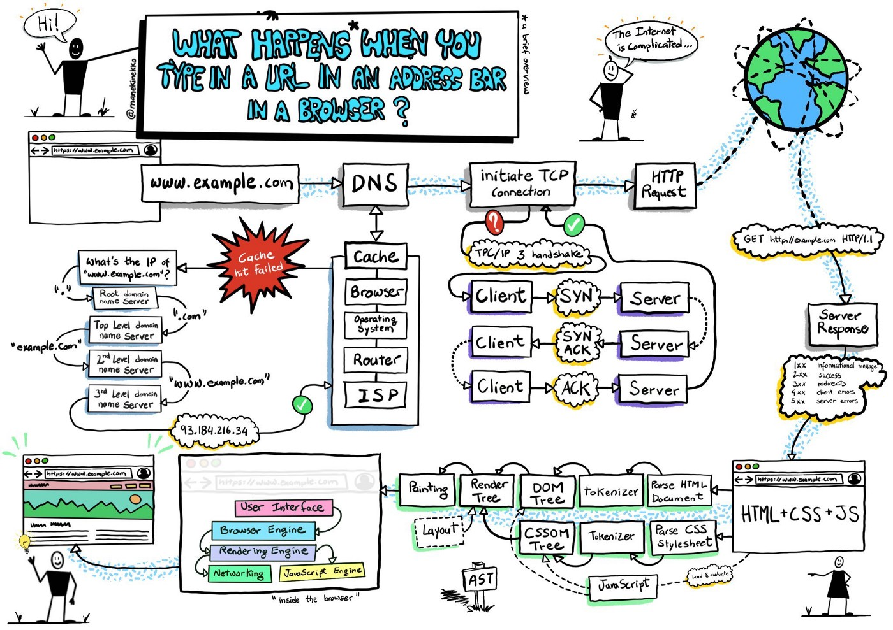

# What happens when you type a URL into your browser 

let first look into url https://www.pesto.tech/become-a-developer what it contain

Let’s break down the parts of this URL 

https://www.pesto.tech/become-a-developer

* Scheme

https:// is the scheme. HTTPS stands for Hypertext Transfer Protocol Secure. This scheme tells the browser to make a connection to the server using Transport Layer Security, or TLS. TLS is an encryption protocol to secure communications over the Internet. With HTTPS, the data exchanged between  browser and the server, like passwords or credit card info, is encrypted.

* Domain

pesto.tech is the domain name of the site. It is the memorable address and points to a specific server’s IP address.

* Path

Sometimes there is an additional path to the resource in the URL. For example, for this URL,https://www.pesto.tech/path-to/some-resource, the-path-to is the path on the server to the requested resource, some-resource. it is more like the directory structure of files and other directories on  computer. It’s a way to organize  resources, whether they are static HTML, CSS, Javascript, or image files, or dynamically generated content.

 ## now lets know haw url work in browser

1. When you enter a URL into a web browser, the browser looks up the IP address for the domain name via DNS.
2. The browser sends a HTTP request to the server. The HTTP request will be sent using the port 80 as default or it will be sent through port 443 if it is HTTPS.
3. The browser will check for the domain name in caches in this respective order — Browser, Operating System, Router and finally your Internet Service Provider.
4. Once the browser gets the physical address of the server, the browser initiates the TCP connection and the server sends back a HTTP response.
5. The browser begins rendering the HTML which is done in 4 steps given below.
  * HTML is parsed to begin construction of the DOM tree.
  * Construction of the render tree begins from using the DOM Tree and CSSOM tree.
  * The layout process begins based upon the blueprint constructed in the previous step. This is responsible for placing the elements   in their respective positions.
  * The painting process will begin and takes care of displaying the elements according to their structure to the user with the help of the browser’s UI back end layer.
6. The browser sends requests for additional objects embedded in HTML (images, CSS, JavaScript) and repeats steps 3–5. Each subsequent request completes a request/response cycle and is rendered in turn by the browser.
7. Once the page is loaded, the browser sends further asynchronous requests as needed. A asynchronous request is a request that doesn’t block the client which means the client does not have to wait until the current request is completed. whereas a synchronous request blocks the client until the current operation is completed.

## The browser's main functionality
The main function of a browser is to present the web resource you choose, by requesting it from the server and displaying it in the browser window. The resource is usually an HTML document, but may also be a PDF, image, or some other type of content. The location of the resource is specified by the user using a URI (Uniform Resource Identifier).

The way the browser interprets and displays HTML files is specified in the HTML and CSS specifications. These specifications are maintained by the W3C (World Wide Web Consortium) organization, which is the standards organization for the web. For years browsers conformed to only a part of the specifications and developed their own extensions. That caused serious compatibility issues for web authors. Today most of the browsers more or less conform to the specifications.

Browser user interfaces have a lot in common with each other. Among the common user interface elements are:

Address bar for inserting a URI
Back and forward buttons
Bookmarking options
Refresh and stop buttons for refreshing or stopping the loading of current documents
Home button that takes you to your home page
Strangely enough, the browser's user interface is not specified in any formal specification, it just comes from good practices shaped over years of experience and by browsers imitating each other. The HTML5 specification doesn't define UI elements a browser must have, but lists some common elements. Among those are the address bar, status bar and tool bar. There are, of course, features unique to a specific browser like Firefox's downloads manager.

The browser's high level structure
The browser's main components are (1.1):

The user interface: this includes the address bar, back/forward button, bookmarking menu, etc. Every part of the browser display except the window where you see the requested page.
The browser engine: marshals actions between the UI and the rendering engine.
The rendering engine : responsible for displaying requested content. For example if the requested content is HTML, the rendering engine parses HTML and CSS, and displays the parsed content on the screen.
Networking: for network calls such as HTTP requests, using different implementations for different platform behind a platform-independent interface.
UI backend: used for drawing basic widgets like combo boxes and windows. This backend exposes a generic interface that is not platform specific. Underneath it uses operating system user interface methods.
JavaScript interpreter. Used to parse and execute JavaScript code.
Data storage. This is a persistence layer. The browser may need to save all sorts of data locally, such as cookies. Browsers also support storage mechanisms such as localStorage, IndexedDB, WebSQL and FileSystem.

It is important to note that browsers such as Chrome run multiple instances of the rendering engine: one for each tab. Each tab runs in a separate process.

## The rendering engine
The responsibility of the rendering engine is well Rendering, that is display of the requested contents on the browser screen.

By default the rendering engine can display HTML and XML documents and images. It can display other types of data via plug-ins or extension; for example, displaying PDF documents using a PDF viewer plug-in.

Different browsers use different rendering engines: Internet Explorer uses Trident, Firefox uses Gecko, Safari uses WebKit. Chrome and Opera (from version 15) use Blink, a fork of WebKit.

## The main flow
The rendering engine will start getting the contents of the requested document from the networking layer. This will usually be done in 8kB chunks.

After that, this is the basic flow of the rendering engine:

The rendering engine will start parsing the HTML document and convert elements to DOM nodes in a tree called the "content tree". The engine will parse the style data, both in external CSS files and in style elements. Styling information together with visual instructions in the HTML will be used to create another tree: the render tree.

The render tree contains rectangles with visual attributes like color and dimensions. The rectangles are in the right order to be displayed on the screen.

After the construction of the render tree it goes through a "layout" process. This means giving each node the exact coordinates where it should appear on the screen. The next stage is painting–the render tree will be traversed and each node will be painted using the UI backend layer.

The rendering engine will try to display contents on the screen as soon as possible. It will not wait until all HTML is parsed before starting to build and layout the render tree. Parts of the content will be parsed and displayed, while the process continues with the rest of the contents that keeps coming from the network.

Main flow examples

