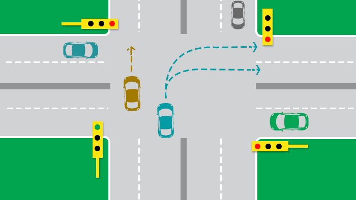
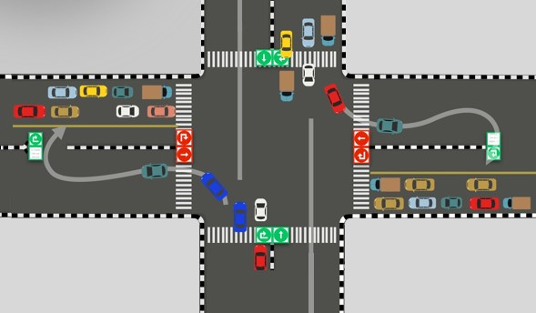
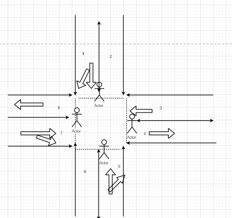

-------QUE1 -------------

# Design Thinking

as in the give problem statement to solve the problem of pedestrian , bike passage and people with disabilities we have to controll the trafic flow in such a way so these pepole can cross the lane safely , so to solve this problem let see haw traffic flow normaly in A Four-Way Crossing and then we see the best possible solution to solve for smooth flow of traffic

* A Four-Way Crossing

The most common type of crossing is a four-way intersection. It generally appears in a perpendicular angle in most of the cities. In a four-way crossing,we will find four traffic signals at the front of each lane that turn green one by one. Thus a vehicle has to wait for all the three lanes to pass before the signal turns green. As the signal turns green the vehicle is allowed to move forward (straight) and to its right, and in certain cases it can also move left even when the signal is red.

* Smart Crossing for smooth flow of traffic

In the existing 4-phase crossing, a vehicle has to wait for all the three sides to pass before the signal turns green. This results in elongated queues and congestion at every lane. Smart Crossing converts this conventional  4-phase traffic signal to 2 phase traffic signal, by turning the two opposite signals green at a time. It prohibits to take a right turn, resulting in a smooth flow of traffic from two opposite lanes at a time. In order to turn right from the crossing, one has to take a c-turn (which is nothing but a left turn followed by a u-turn) as shown in the diagram below.

## benifit of using smart Crossing 

* reduction in traffic congestion
* it also solves the problem of long waiting time at the signals and yield confusions
* it require minimal infrastructural changes
* it help pedestrian,people with disabilities etc. to cross lane safely
* Traffic congestion reduction by upto 80%
* Air pollution due to traffic reduced by upto 50%
* Chances of getting green light increased by upto 50%

* lane rules 
 - in left lane people can go straight or trun left
 - in right lane people can go only straight 
 - if signal is red then people have to wait 
 - if signal is green then people can move

 * pedestrian and strollers and wheelchairs rules

 - if signal is red then can cross the lane 
 - if signal is green then they have to wait till signal cross the lane 

-------QUE2 -------------

# Product Mindset

#### Smarto Releases Smart classroom to its customers

Smart classroom uses smartest way to teach online studets with whiteboard and make connection with chat

April 1st, 2021. Smarto is excited to announce the addition of  Video Conferencing,Chat rooms and whiteboard to our smart classroom product. The new capability, “Smart classroom”, where teacher and student can connect with each other through video/audio/chat and teacher can use white board to teach new topics to there students , smart classroom is easy to use where teacher can create classroom to there student and invite there student through there email id 

The COVID-19 pandemic disrupted the world in ways unimaginable. As we look back on the past two years and the harsh repercussions of the pandemic that continue until today, it is apparent that one of the most impacted sectors was education. Neither the world nor educational institutions were prepared so as result,Students, schools, colleges and universities have been deeply impacted. According to the United Nations Educational, Scientific and Cultural Organisation (UNESCO), over 800 million learners from around the world have been affected, 1 in 5 learners cannot attend school, 1 in 4 cannot attend higher education classes, and over 102 countries have ordered nationwide school closures while 11 have implemented localised school closure.

Smart classroom enables the teacher and the student to set their own learning pace, and there’s the added flexibility of setting a schedule that fits everyone’s agenda. As a result, using an Smart classroom platform allows for a better balance of work and studies, so there’s no need to give anything up. Studying online teaches you vital time management skills, which makes finding a good work-study balance easier. Having a common agenda between the student and teacher can also prompt both parties to accept new responsibilities and have more autonomy. 

“We are excited to help our education system become much more efficient,’’ said Will Canis-La Trans, VP of Product at Smarto  Communication Technologies, “with Smarto  Smart classroom, we are releasing the whiteboard and Video Conferencing features to make feel student and teacher as they experience in offline classes.”

smart classroom users can start using this feature today. When you create new classroom you will see new features .

"smart classroom is great for brainstorming with students during virtual classrom. It has been a great solution for us since we have all been teaching from home during the pandemic."

Log on to your Smart classroom account today to begin using this feature! You can use the feature for free for up to 10 classes per week while Smart classroom is in beta mode.

## **FAQs**

**1. What's smart classroom ?**
smart classroom is a plateform for students and teachers to conduction online classes

**2. is smart classroom free ?**
yes its free up to 10 classes per week in beta version

**3. haw to login smart classroom ?**
you can use googel,facebook or email id 

**4. Can I use a bluetooth headset?**
Yes, as long as the bluetooth device is compatible with the computer or mobile device that you are using.

