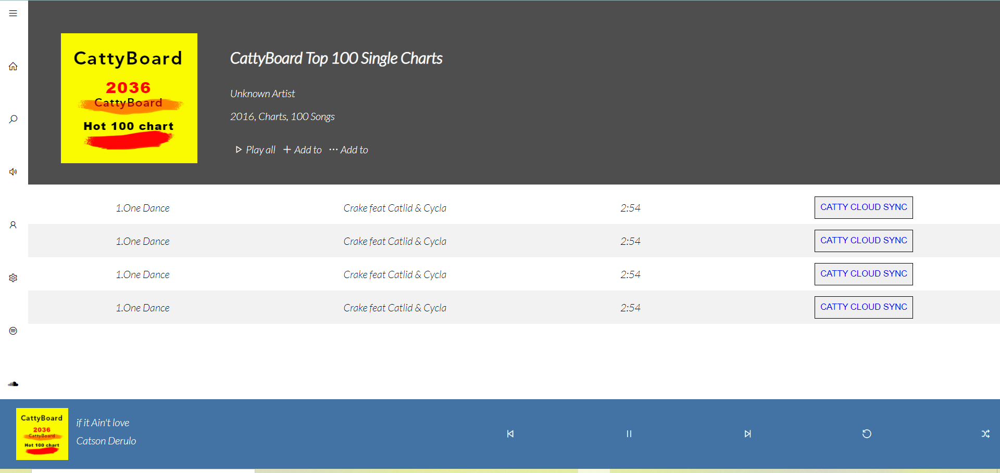

# Music Player Webpage Ui

## Screenshots

## Tech used

 HTML , CSS

## Installation

* Clone this github repo using git clone "xyz"

## How to use?

* Open clone file and goto week-1 folder 
* Then open index.html and right click 
* Then click on open with live server 
[About Live Server](https://marketplace.visualstudio.com/items?itemName=ritwickdey.LiveServer)